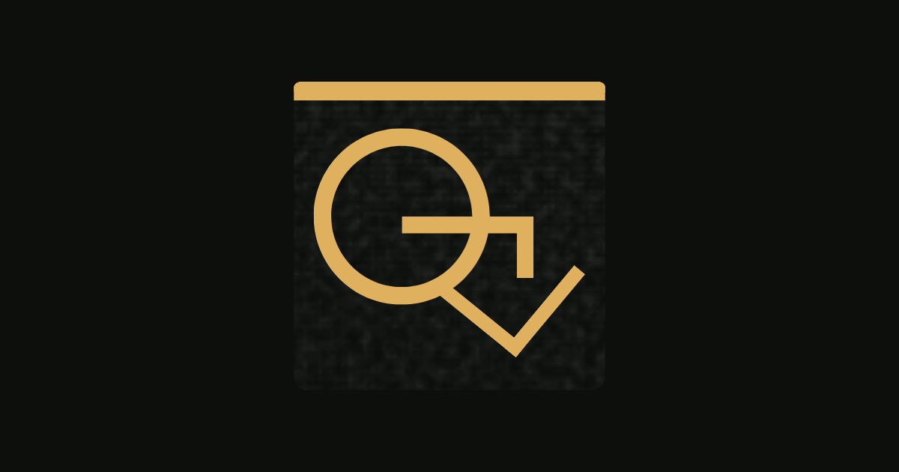

# GraphView

**Your personal knowledge graph — local-first, private, and fast.**

Turn everything you read into a living map. Drop in PDFs, notes, and web pages;
GraphView builds a force-directed graph of how your knowledge connects, with a
metered AI assistant that explains on request — never a chatbot, never a
storage company. Your files stay on your machine.

 

---

## Download

  <a href="https://github.com/sks17/GraphView/releases/latest/download/GraphView-Setup.exe">
    <b>👉 Download GraphView for Windows (GraphView-Setup.exe)</b>
  </a>

Click the link above to download the installer, then run it. That's it — see
[Install](#install) for the 30-second walkthrough. Looking for an older build?
Every release is on the [Releases](https://github.com/sks17/GraphView/releases)
page.

## Why GraphView

- **Local-first.** Your documents, notes, and AI outputs live in a real folder
  on your device (`~/GraphMind`), laid out like the graph. GraphView is not a
  storage service — your files never have to leave your machine.
- **A graph, not a feed.** Every document, section, highlight, note, and AI
  explanation is a node. See how ideas connect across everything you've read.
- **Read and ask.** Open a PDF, highlight a passage or drag a region, and ask
  the AI to explain it. Answers stream in, and you choose what to keep as a
  node.
- **A metered assistant, by design.** The AI explains and *proposes* structure
  you confirm — with built-in budgets so costs never run away.
- **Optional cloud backup — on your terms.** Point your backup folder at a path
  your OneDrive, Dropbox, or Google Drive already syncs, and every snapshot is
  copied to the cloud automatically. It's an opt-in safety net, never the
  primary store.

## Install

1. **[Download GraphView-Setup.exe](https://github.com/sks17/GraphView/releases/latest/download/GraphView-Setup.exe).**
2. Run it. It installs just for you — **no administrator rights needed** — and
   adds a **GraphView** shortcut to your Start menu.
3. Launch GraphView. It opens in your browser at a private local address; all
   data stays on your device.

> Windows SmartScreen may show a "Windows protected your PC" notice for a new
> publisher. Click **More info → Run anyway** to continue.

## Backups & optional cloud sync

GraphView keeps a one-click backup — a single zipped snapshot of your database,
files, and vault.

1. Open the command palette and choose **“Backups & cloud sync folder.”**
2. Set the **backup folder** to a path your cloud client already syncs, e.g.
   `C:\Users\you\OneDrive\GraphView Backups`.
3. Click **Back up now** (or let the periodic reminder prompt you).

The snapshot lands in that folder and your cloud client mirrors it
automatically — no accounts, no third-party access to your data.

## System requirements

- **Windows 10 or 11, 64-bit.**
- ~300 MB free disk space for the app, plus room for your documents.
- An internet connection is needed only for AI features; reading and browsing
  your graph work offline.

## Updating

Download the latest `GraphView-Setup.exe` and run it — it installs over the
previous version. Your data in `~/GraphMind` and your settings are preserved.

## Uninstalling

Use **Settings → Apps → GraphView → Uninstall** (or the Start-menu “Uninstall
GraphView” shortcut). Uninstalling removes the app only; your documents and
backups are left untouched.

## Support

Questions, bugs, or licensing inquiries: **sakshamsinghbhs@gmail.com**

## License

GraphView is proprietary software. © 2026 Saksham Singh. All rights reserved.
See [LICENSE](LICENSE).
